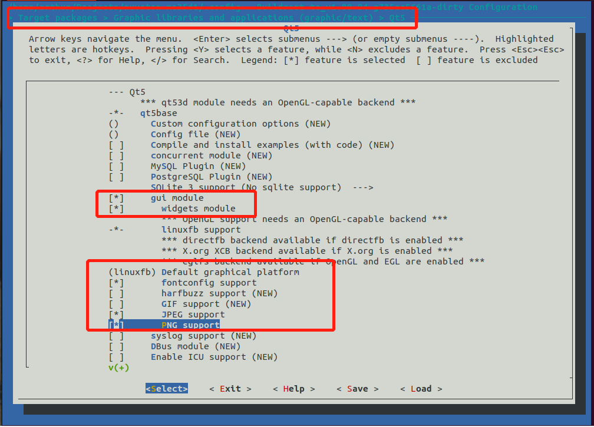

## Freelink步骤：
1. bmp 300x300
2. 加入bitmap资源  加入现有项
3. 加入dialog资源
   （a）
4. dialog生成cpp
   控件变量
5. FreeLinkDlg.h 增加dlg头文件
   FreeLinkDlg.cpp 增加dlg变量   Sensor_Pressure                m_Sensor_Pressure;
   OnDeviceChange（）   m_Sensor_Pressure.CloseTimers();
   Tab_initialization（） m_Sensor_CurrentL.Create(IDD_Sensor_Pressure, &m_ProductTab);
                           m_Sensor_CurrentL.SetWindowPos(NULL, tabRect.left, tabRect.top, tabRect.Width(), 
		                      tabRect.Height(), SWP_HIDEWINDOW);
   Tab_SensorWindowHide（）  m_Sensor_CurrentL.SetWindowPos(NULL, tabRect.left, tabRect.top, tabRect.Width(),
			      tabRect.Height(), SWP_HIDEWINDOW);    
   Tab_SensorChoice（）                       
6. tree
    ProductTree_initialization() 
       hArtItem = m_ProductTree.InsertItem(_T("Pressure"), 2, 2, hCataItem, TVI_LAST);
	     m_ProductTree.SetItemData(hArtItem, 15); TreeNodeHandle[15] = hArtItem;  
    OnTvnSelchangedProducttree()  
      case 15:
		    if (flag_Tab_Sensors == 0)Tab_ShowSensors();
		     flag_Tab_Sensors = 1;
		     flag_Tab_Receivers = 0;
		     flag_Tab_Radios = 0;
		     m_ProductTab.SetCurSel(16);
		     Tab_SensorChoice(16);
    Tab_SensorChoice()
          case 16:
		         Tab_SensorWindowHide();

		         m_Sensor_Pressure.SetWindowPos(NULL, tabRect.left, tabRect.top, tabRect.Width(),
			       tabRect.Height(), SWP_SHOWWINDOW);
		         m_ProductTree.SelectItem(TreeNodeHandle[18]);//显示指定树形节点
6. 协议处理：
  m_FreeLink_Sensor_Pressure：全局工程指针，不用初始化
  Sensor_Pressure_handle 本对话框指针          Sensor_Pressure_handle = m_Monitoring.GetParent()->GetParent()->GetParent();
  m_Progressone_Pressure 进度条句柄       OnInitDialog（）       m_Progressone_Pressure = (CProgressCtrl*)GetDlgItem(IDC_Progress);
 (1) OnBnClickedMonitoring（）
     Button_initialization（）
     OnTimer（）
     OnBnClickedConfigure()  共用
（2）   sensor_read（）
  
## Freelink改造

1. ProductTree_initialization
2. Tab_initialization
3. Tab_SensorWindowHide
    Tab_HideAllWindows
4. OnTvnSelchangedProducttree
5. error C2061: 语法错误: 标识符"string"   using namespace std;
6. Cedit的消息 ON_CONTROL_RANGE(EN_KILLFOCUS, BaseDlgID, BaseDlgID + 31, OnSelChange)
7. Cstring to int _ttoi()
8. 对话框中去除回车键作用
``````
BOOL CKeyBoardToolsDlg::PreTranslateMessage(MSG* pMsg)
{
	// TODO: Add your specialized code here and/or call the base class
	if(pMsg->message == WM_KEYDOWN)
	{
		switch(pMsg->wParam)
		{
		case VK_RETURN:		//屏蔽回车
		case VK_ESCAPE:		//屏蔽ESC
			  return true;
		}
	}
	return CDialog::PreTranslateMessage(pMsg);
}
``````
9. 增加timer  ON_WM_TIMER()


## VS 动态控件的响应
二.非Button类消息响应的添加（当然，Button类的也可以用此方法）

1.在控件的父窗口头文件添加：

afx_msg void OnButtonClick(UINT uID);

2.BEGIN_MESSAGE_MAP()与END_MESSAGE_MAP()间添加：
ON_COMMAND_RANGE(IDC_Dynamic_Button, IDC_Dynamic_Button + 31, OnButtonClick)//消息响应

ON_CONTROL_RANGE(CBN_SELCHANGE,IDC_Dynamic_Button, IDC_Dynamic_Button + 31, OnSelChange)//消息响应      

3.消息响应函数体：

void CParentDlg::OnButtonClick(UINT uID)   //消息响应函数体
{
	int ButtonIndex = uID - IDC_Dynamic_Button;//这里用uID-第一个Button的ID来判断 具体按下的Button的序号
	//以下添加响应函数
}
    
## vs中用 printf打印调试信息

1. 在配置属性中，生成事件->生成后事件

  在命令行的右边空白处添加“editbin /SUBSYSTEM:CONSOLE $(OUTDIR)\$(ProjectName).exe”，无引号，点击确定。

2. 在文件开头加 #define _CRT_SECURE_NO_WARNINGS

## CEDit控件回车键的捕捉

1. .h  加 BOOL PreTranslateMessage(MSG* pMsg);
2. .c  加

``````

BOOL CDynamicMultiCtrlsDlg::PreTranslateMessage(MSG* pMsg)
{
	if ((pMsg->message == WM_KEYDOWN && (pMsg->wParam == VK_RETURN)))
	{

		if (GetFocus() == GetDlgItem(EDIT_ID)) //根据不同控件焦点判断是那个在执行 

		{
			
			((CEdit*)GetDlgItem(EDIT_ID))->SetSel(0, -1);   //清空Edit框所有内容
			return TRUE;
		}
#if 0	
		HWND hwnd1 = ((CEdit*)GetDlgItem(EDIT_ID))->m_hWnd;
		if (pMsg->hwnd == hwnd1)
		{
			((CEdit*)GetDlgItem(EDIT_ID))->SetSel(0, -1);   //清空Edit框所有内容

									//m_edit.PostMessage(EM_SETSEL, 0, -1)
			//OnBnClickedBtnOk();
		}
#endif
	}
	return CDialog::PreTranslateMessage(pMsg);
}

``````


            

129.226.131.138  ubuntu Szm123~!

void markallBad()
{
  row_address_t row;
  int ret;
  TRACE("MARKBAD");
  for(int j=0;j<SPI_NAND_BLOCKS_PER_LUN;j++)
  {
     for(int i=0;i<64;i++)
     {
        row.block = j;
        row.page=i;
        ret = page_read(row);
        if(ret != SPI_NAND_RET_OK)
        {

            spi_nand_block_mark_bad(row);
            TRACE("mARK BAD row=%d",row.block);
            break;
        }
     }


  }

}


mklittlefs.exe -c data --size 16252968 --page 256 --block 4096 ext-spiffs.bin

esptool-3.0\esptool.py --chip esp32 --port com18 --baud 115200 write_flash 0x80000 ext-lfsvoice.bin --flash_mode dio --flash_size 16MB --spi-connection 13,12,15,2,0


//register 0:  0c  hallconf-0xc gain:0 res:0
//1:         0xc380  burst-rat:0 xyz, int  spi
//2:      0x07e5  osr:1 flt:1  res:3  osr2:0
//4: 0x4000    offsetx
//5: 0x4000    offsety
//6: 0x4000    0ffsetz


//0x1e  memory store
//exit
//start burst 0x1e 1.8ms
//read measurement   0x4e


#CRSF协议：
  1.  sync 
  Radio.TXdataBuffer[0] = SYNC_PACKET & 0b11;
  Radio.TXdataBuffer[1] = FHSSgetCurrIndex();
  Radio.TXdataBuffer[2] = NonceTX;
  Radio.TXdataBuffer[3] = (Index << 6) + (TLMrate << 3) + (SwitchEncMode << 1);
  Radio.TXdataBuffer[4] = UID[3];
  Radio.TXdataBuffer[5] = UID[4];
  Radio.TXdataBuffer[6] = UID[5];
  // For model match, the last byte of the binding ID is XORed with the inverse of the modelId
  if (!InBindingMode && config.GetModelMatch())
  {
    Radio.TXdataBuffer[6] ^= (~crsf.getModelID()) & MODELMATCH_MASK;
  }
  2. NextPacketIsMspData
        Radio.TXdataBuffer[0] = MSP_DATA_PACKET & 0b11;
      Radio.TXdataBuffer[1] = packageIndex;
      Radio.TXdataBuffer[2] = maxLength > 0 ? *data : 0;
      Radio.TXdataBuffer[3] = maxLength >= 1 ? *(data + 1) : 0;
      Radio.TXdataBuffer[4] = maxLength >= 2 ? *(data + 2) : 0;
      Radio.TXdataBuffer[5] = maxLength >= 3 ? *(data + 3): 0;
      Radio.TXdataBuffer[6] = maxLength >= 4 ? *(data + 4): 0;
  3. GenerateChannelDataHybrid8
            Buffer[0] = RC_DATA_PACKET & 0b11;
            Buffer[1] = ((crsf->ChannelDataIn[0]) >> 3);
            Buffer[2] = ((crsf->ChannelDataIn[1]) >> 3);
            Buffer[3] = ((crsf->ChannelDataIn[2]) >> 3);
            Buffer[4] = ((crsf->ChannelDataIn[3]) >> 3);
            Buffer[5] = ((crsf->ChannelDataIn[0] & 0b110) << 5) |
                        ((crsf->ChannelDataIn[1] & 0b110) << 3) |
                        ((crsf->ChannelDataIn[2] & 0b110) << 1) |
                        ((crsf->ChannelDataIn[3] & 0b110) >> 1);
            Buffer[6] =
             TelemetryStatus << 7 |
        // switch 0 is one bit sent on every packet - intended for low latency arm/disarm
            CRSF_to_BIT(crsf->ChannelDataIn[4]) << 6 |     /////1号开关
        // tell the receiver which switch index this is
            bitclearedSwitchIndex << 3 |                  ////第几号开关
        // include the switch value                       ///值
             value;
  
     GenerateChannelDataHybridWide
        buffer[6]   b/tel| b/sw0| sw6
////////////////////////////////////////////////////////////////////
int16_t checkIncDec16( int16_t val, int16_t i_min, int16_t i_max, uint8_t i_flags)
   val:now value
   bool: i_min=0 i_max=1
  i_flags & INCDEC_SWITCH 
  eeDirty(i_flags & (EE_GENERAL|EE_MODEL));
int8_t checkIncDecSwitch( int8_t i_val, int8_t i_min, int8_t i_max, uint8_t i_flags)
     i_val = switchUnMap( i_val ) ;
     return switchMap( checkIncDec16(i_val,i_min,i_max,i_flags) ) ;
     
     i_val :键值编码
     switchunmap[ival]   :  在switchmap中的序号
     序号加减
     获取序号中的键值编码  switchmap
     
int8_t phyStick[4] ;  左右摇杆值
const char stickScramble[] =         手形对应的摇杆编号
{
  0, 1, 2, 3,
  0, 2, 1, 3,
  3, 1, 2, 0,
  3, 2, 1, 0
} ;   

uint8_t modeFixValue( uint8_t value )  根据当前手形， aetr中摇杆对应的采样编号+1
                                  采样顺序   0-左边水平  1-左边垂直  2-右边垂直   3-右边水平
                                  value： 0 -a  1-e  2-t  3-r      手形0:aetr
                                  
程序里的0-3永远是aetr, 要根据手形获取正确的采样值
                                  
                                  
int16_t getRawTrimValue( uint8_t phase, uint8_t idx )  flightmode 下的trim值 phase=0 无flight flight从1开始计数
uint32_t getTrimFlightPhase( uint8_t phase, uint8_t idx ) 看不懂
                                  

#define MAX_SKYDRSWITCH 34               true      常量开关  正值t 负值f
>   MAX_SKYDRSWITCH  是物理按键


int16_t scaleAnalog( int16_t v, uint8_t channel )
1.  v 为正负百分数
2.   g_eeGeneral.calib？为正百分数
3.  输出最大值 正负1024

## Bertrand

1.  don't forget that the bootloader for factory should be compiled with FACTORY=YES, it's not the same than the bootloader we offer on github:
- it writes G911 config
- it writes the board info on Flash
- it writes RF mode (FCC / EU) on Horus

## 新唐

https://www.nuvoton.com.cn/products/microprocessors/arm-cortex-a35-mpus/ma35d1-high-performance-edge-iiot-series/design-resource/


1.ffmpeg -i "xx.mp4" -t 15 -c:v libx264 -profile:v baseline -level:v 3.1 -an baseline_3.1.h264  转成264

2. gst-launch-1.0 location=/xx/xx.h264 | h264parse | v412h264 dec | ..vsink | fakesink sync=false

3. https://mp.weixin.qq.com/s/n9St9SsTXsA6QS65sAB1AA

4. 通过 gstreamer video pipeline videosink 来播放

5. gstreamer上可以做overlay,  应该是软件加上去的，
   直接对fb进行overlay, 不是视频层
   MA35D1的LCD驱动层原生支持overlay, 效率很高
   因为有两个fb,   /dev/fb0, /dev/fb1,   fb1 就是overlay, 可以“任意任性地”在上面画东西
   也可以不用overlay設計，side-by-side也不錯
   如果直接“manipulate"视频影响效能，那就分层设计（fb overlay），全屏图形窗口在fb0, 视频为非全屏在fb1, 将OSD绘制在fb0
   支持alpha blending （fb overlay）

6. ffmpeg -i input.mp4 -an -c:v libx264 -profile:v baseline -level:v 3.1 out_baseline_3.1._level.h264

7. 在MA35D1开发板中/opt/ma35d1_demo.sh
gst-launch-1.0 filesrc location=/opt/video_mp4.mp4 ! qtdemux name=demux  demux.audio_0 ! queue ! decodebin ! audioconvert ! audioresample ! autoaudiosink demux.video_0 ! queue ! decodebin ! nufbdevsink ! fakesink sync=true &

gst-launch-1.0 filesrc location=/mnt/out60_high.h264 ! h264parse ! v4l2h264dec  ! videoconvert 
 ! nufbdevsink

 # gst-launch-1.0 filesrc location=/mnt/out60_baseline.h264 ! h264parse ! v4l2h264dec  ! videoconvert  ! nufbdevsink

gst-launch-1.0 filesrc location=/mnt/911.h264 : h264parse ! v4l2h264dec ! videoconvert ! nufbdevsink ! fakesink sync=true

ffmpeg -i "kk.h264" -an -t 15 -vcodec copy 911.h264

ffmpeg -i input.mp4 -filter:v fps=30 -codec:v libx264 -an output.high.30fps.h264
ffmpeg -i xx.h264 -vf scale=640:480 ..

1） make menuconfig 配置buildroot设成从nand 启动

2）source ma35d1-portal/scripts/build-package.sh uboot clean 

3) 烧写


telnet 192.168.0.100 22

$ vi /etc/ssh/sshd_config
$ /etc/init.d/S50sshd restart

1）make qt5base-dirclean
2）make menuconfig (配置Buildroot, 将Qt5选上）

3）make
4）再次打开Qt Creator 对Kits进行配置

网络设置：
1） 已将网格中的桥接设为有线
2） 需要连目标机时，虚拟机设置网络桥接。然后设ip.sudo ip addr set 192.168.0.131/24 dev ens33
3) 需要连外网时，虚拟机设置网络nat,然后重启。


## mchsh 

1. 需要将site_scons设置到环境变量 PYTHONPATH
2. 在app中执行scons
3. hal目录中有config.py


## github

1. ssh -T git@github.com
2. GIT_CURL_VERBOSE=1 GIT_TRACE=1  git clone 
3. curl -I google.com
4. https时需要在前面加用户名  git clone https://shang2017@github.com/...

1. git clone 没有文件
2. git branch -a
3. git checkout remotes/origin/main
4. git symbolic-ref HEAD refs/heads/symbol-you-want 
5. git branch main
git branch --set-upstram-to=origin/main main


## vmware中/dev/sda3扩容
1. fdisk -l / df -TH
2. sudo fdisl /dev/sda
3. d3/删除   p查看
4. n3   p查看
5. w
6. partprobe /dev/sda 通知操作系统分区表变化
7. resize2fs /dev/sda3

## arduino
1. addition http 一行一个
2. 然后board中搜索srm32


## servo
i:\virtualbox

## motor
1. float type:FP_NAN,FP_INFINITE,FP_NORMAL.FP_SUBMODULE,FP_ZERO
2. 类型判别： sizeof(val+(float)0) = sizeof(float)
3.usbtocan：  nucleo  stm32f446
              https://github.com/bgkatz/USBtoCAN
              https://os.mbed.com/users/benkatz/code/CanMasterTest/


## arduino 自定义板子   

https://cn.gwsigeps.com/14065-Arduino-IDE-Creating-Custom-Boards-17

1.  arduino15/packages/*/*/boards.txt
    build instructions and configuration
2. platfrom.txt compileer instruction 
3. bootloaders  
4. variants  board layout and pin configurations
5. variant.cpp  variants/baord_name/variants.cpp
6. variant.h pin use configuration 
7. package_boardname_index.json

## platformio 自定义板子
https://blog.csdn.net/roctwo/article/details/126684367

1. 完全自定义：  C:\Users\userName\.platformio\platforms\ststm32\boards
variant :中内容和arduino共用

2. arduino 下加： C:\Users\userName\.platformio\packages\framework-arduinoststm32
3. arduino 中variant
  boards_entry.txt  声明
  generic_clock.c SystemClock_config(void)
  PinNamesVar.h
  variant_xxx.cpp/.h
  *.ld

## WIN10 远程win11中vmware中win10

1. vmware中win10设置
   右键计算机-属性-远程桌面-打开，高级中添加用户1-1（111），打开后有连接名:DESKTOP-E7TBAVJ
2. 原vmware网络设置： 网格--桥接  设置网络：NAT.  主机/vmware能互ping, vmware能ping通远程，但远程不能ping通vmware.
   将设置网络：桥接。 远程能够ping通vmware.能够远程登录，但vmware不能上网，不能ping通本机和远程。
   这时将vmware的ip改成与本机同一网段，则可以ping通本机和远程。但还是不能上外网。被公司所限。但以前能上网？
3. 0-0 p000远程


## Flutter Provider

1. ChangeNotifierProvider
   model : with ChangeNotifier   notifyListeners();
   widget: ChangeNotifierProvider<MyModel>(
              create :
               child:
           Consumer<MyModel>( //                  <--- Consumer
                    builder: (context, myModel, child) {
                    return RaisedButton(
   创建要获取数据，但不更新的widget provider.of<model>(context,listen:false)
   class MyButton extends StatelessWidget {
      @override
      Widget build(BuildContext context) {
         final myModel = Provider.of<MyModel>(context, listen: false);
         return RaisedButton(
         child: Text('Do something'),
         onPressed: () {
          myModel.doSomething();
         },
         );
      }
   }
2. MultiProvider
   model : 同上
   widget: 
      return MultiProvider( //                                     <--- MultiProvider
      providers: [
        ChangeNotifierProvider<MyModel>(create: (context) => MyModel()),
        ChangeNotifierProvider<AnotherModel>(create: (context) => AnotherModel()),
      ],
      child: Consumer<MyModel/AnotherModel>( //            <--- MyModel Consumer
                        builder: (context, myModel, child) {
                           return widget
 
## flutter 状态管理

1. 创建数据结构class
2. 创建model,其中ChangeNotifier，notifyListeners（）
3. 创建store ，其中包含所有的MultiProvider，有connect和value,value可以有更新的和不更新的
4. 创建page, Store.value<Counter>(context).increment();  获取数据


## flutter 路由管理

1. 创建route文件，包含静态路由 path,name
   static GoRouter router = GoRouter(
      GoRoute(
        // 传递参数方式1, 参数格式类似URL：/search?query=flutter
        name: searchNamed,
        path: searchPath, // 问号格式的参数，在路径中不需要包含参数信息
        builder: (context, state) 
      )

2.  路由参数获取：
    a. 问号调用方式：
         // GoRouter.of(context).pushNamed(AppRoutes.searchNamed, queryParams: {'query': 'abcd'});
        // GoRouter.of(context).push('${AppRoutes.searchPath}?query=flutter');
        // GoRouter.of(context).go('/search?query=flutter');
          final query = state.uri.queryParameters['query'];
          return SearchPage(query: query!);
    b. 路径调用方式：
       
        // GoRouter.of(context).pushNamed(AppRoutes.searchNamed, pathParameters: {'id': 'abcd'});
        // GoRouter.of(context).push('${AppRoutes.movieDetailPath}/654321');
        // GoRouter.of(context).go('/movie_detail/654321');
         movieDetailPath: '$movieDetailPath/:id',
         final id = state.pathParameters ['id']!;
          return MovieDetailPage(id: id);

3. main中路由widget
 return MaterialApp.router(

   routerConfig: AppRoutes.router,


## github一直更新不上去

在ssh key所在文件夹下添加一个文件,文件名是config

内容：

Host github.com
User  yourmail@xx.com
Hostname ssh.github.com
PreferredAuthentications publickey
IdentityFile ~/.ssh/id_rsa
Port 443

## git 中gitignore
1. build/ 是将所有层级的build目录都忽略
2. /build是指在.gitignore同级目录下
3. /**/是指任意目录

## platformio
1. platform.ini
   src_dir 默认是 src/
   build_src_filter 需要定位到目录  **/任意目录
   需要加入startup_stm32g431rbtx.s 才能正常工作。 

2. 会首先编译C:\Users\0-0\.platformio\packages\framework-stm32cubeg4\Drivers\STM32G4xx_HAL_Driver 不知该怎样处理
   如果将framework置空， src_dir=./（default src)就能为所欲为.

3. 需要增加路径 ：C:\Users\UserName\.platformio\penv\Scripts\  才能执行pio cli. pio run --list-targets


## Arduino_Core_STM32  失败
1.  首先在ubuntu中git
2.  git CMake_workspace/sketchbook/1_Blink/
3.  cmake -G Ninja -S ./1_Blink -B ./1_Blink/build # -S source -B build, nowadays you want to separate the two
    cmake --build ./1_Blink/build # build, or rebuild, the project (target "all")
4.  apt install cmake   //can not find cmake
5.  apt install ninja-build  //can not find Ninja 
    没用。
    pip install ninja  // sudo apt install python3-pip
    
## platformio unitest

## lora  
1. lora-b1s
2. Lilygo lora


## Mission planner 在ubuntu中的使用

1. https://www.mono-project.com/download/stable/#download-lin  安装mono环境
2. https://www.mono-project.com/docs/getting-started/mono-basics/  mono测试
3. mono MissionPlanner.exe 出现错误  ailed to load module "canberra-gtk-module"
   sudo apt-get install libcanberra-gtk-module


1. https://blog.csdn.net/m0_67316550/article/details/136059332
   sudo apt update
sudo apt install build-essential libfontconfig1-dev libfreetype6-dev libx11-dev libxext-dev libxrender-dev libxcb1-dev libxi-dev libgl1-mesa-dev libssl-dev gperf libicu-dev pkg-config bison flex qtchooser
sudo apt install libdbus-1-dev

sudo apt-get install '^libxcb.*-dev' libx11-xcb-dev libglu1-mesa-dev libxrender-dev libxi-dev libxkbcommon-dev libxkbcommon-x11-dev

wget https://download.qt.io/archive/qt/5.15/5.15.2/single/qt-everywhere-src-5.15.2.tar.xz
tar -xf qt-everywhere-src-5.15.2.tar.xz
cd qt-everywhere-src-5.15.2


mkdir build
cd build
../configure -opensource -confirm-license -nomake examples -nomake tests -release
# ../configure -opensource -confirm-license -nomake examples -nomake tests -nomake qt3d -debug-and-release

# 如果您需要支持特定平台或特性，比如gtk2主题，则添加相关选项，例如：
# ../configure -opensource -confirm-license -nomake examples -nomake tests -release -qt-xcb -qt-gtk2

make -j 8
sudo make install

# 其它编译命令
--mkdir build && cd build
--../configure -xcb -opensource -confirm-license -proprietary-codecs -no-feature-webengine-system-ninja -nomake examples -nomake tests
--../configure -xcb -opensource -confirm-license -skip qtwebengine -nomake examples -nomake tests
--make -j
--sudo make install

# 或者使用如下命令编译
# gmake && sudo gmake install

#检查xcb是否齐全
--../configure -recheck-all

sudo gedit /etc/profile
#内容
export QTDIR=/usr/local/Qt-5.15.3
export PATH=$QTDIR/bin:$PATH
export LD_LIBRARY_PATH=$QTDIR/lib

echo 'export PATH=/usr/local/Qt-5.15.2/bin:$PATH' >> ~/.bashrc
source ~/.bashrc

2. https://docs.qgroundcontrol.com/master/en/qgc-dev-guide/getting_started/
git clone --recursive -j8 https://github.com/mavlink/qgroundcontrol.git -b Stable-V4.2

cd qgroundcontrol
mkdir build
cd build
qmake ../
make
sudo make install

3. run stage/QGroundControl ,can not load qtquick window module
https://blog.csdn.net/jiejieaiai/article/details/88928102
export QML2_IMPORT_PATH=$QTDIR/qml
QTDIR = /usr/local/Qt-5.15.2

4. https://blog.csdn.net/qq_33154343/article/details/107219053
https://wiki.qt.io/Building_Qt_5_from_Git

5. https://docs.qgroundcontrol.com/master/en/qgc-dev-guide/getting_started/
vagrand


           


